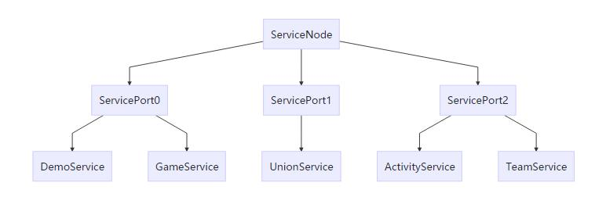

## 基础概念介绍
- ServiceNode: 服务节点，对应进程，每个进程对应一个ServiceNode。一个ServiceNode下面可以挂载或管理若干个ServicePort。
- ServicePort: 服务线程节点，对应线程，每个线程对应一个ServicePort。一个ServicePort下面可以挂载或管理若干个Service。
- Service: 具体的服务，服务的最基本单元。RPC通信的基本单元，所有服务之间的通信调用，都是调用的对应服务的RPC函数。


## ServiceNode、ServicePort、Service三者之间的关系


## 使用步骤
1. 定义Service接口类

```
@ServiceConfig(node = ServiceConsts.NODE0,
        port = ServiceConsts.PORT1,
        serviceImplType = DemoServiceImpl.class)
public interface DemoService {
    /**
     * 无返回值的PRC调用
     */
    void test();

    /**
     * 异步返回值的RPC调用
     */
    CompletableFuture<String> getServiceName();

    /**
     * 阻塞RPC调用
     */
    Integer getId();
}
```

2. 实现Service接口类，和扩展ServiceBase类

```
public class DemoServiceImpl extends ServiceBase implements DemoService {

    /** logger */
    private static final Logger logger = LoggerFactory.getLogger(DemoServiceImpl.class);

    @Override
    public void test() {
        logger.info("1. 执行DemoServiceImpl.test");
    }

    @Override
    public CompletableFuture<String> getServiceName() {
        return CompletableFuture.completedFuture("DemoServiceImpl");
    }

    @Override
    public Integer getId() {
        return 192;
    }

    @Override
    public void init() {
        logger.trace("DemoServiceImpl.init");
    }
}
```

3. 调用RPC函数，支持CompletableFuture返回值类型的异步调用和阻塞调用。
**注意：rpc调用必须在ServicePort线程，否则抛出“throw new IllegalStateException("RPC调用需要在ServicePort线程。")”。因为RPC调用应答需要FromPoint，rpc返回需要在发起方ServicePort执行。**

```
public class InitServiceImpl extends ServiceBase implements InitService {

    /** logger */
    private static final Logger logger = LoggerFactory.getLogger(InitServiceImpl.class);

    @Override
    public void init() {
        logger.trace("InitServiceImpl.init");

        logger.info("1. RPC调用demoService.test()");
        final DemoService demoService = ReferenceFactory.getProxy(DemoService.class);
        demoService.test();

        logger.info("2. RPC调用demoService.getServiceName()");
        final CompletableFuture<String> future = demoService.getServiceName();
        future.whenComplete((s, throwable) -> {
            // 异步处理
            logger.info("2. RPC返回结果：Service名称 = " + s);
        });


        logger.info("3. RPC阻塞调用demoService.getId()");
        final Integer id = demoService.getId();
        logger.info("3. RPC阻塞调用返回。id = {}", id);
    }
}
```


## RPC实现要点
1. RpcInvocation：RPC调用的相关信息，包含了RPC调用的所有数据。用于确定RPC的远程调用点和需要返回数据时的发起点信息，并包含RPC调用的相关方法和参数数据。其中远程调用点CallPoint，用于确定RPC执行的Service存在的node、port位置信息。发起点信息FromPoint，用于需要返回值的RPC，将返回值数据返回对应的调用位置执行。方法名称确定rpc调用函数，参数用于执行函数调用。
2. RPC请求和应答：由于RpcInvocation只是包含RPC函数调用信息，用于执行具体的函数调用。RPC的交互需要的是Request和Response对象。Request包含RpcInvocation数据，并会在每次发送RPC调用时生成一个id，当需要返回值的RPC时，Response中会包含这个id并包返回值对象，用于确定RPC调用的上下文，并执行返回的应答函数。
3. RPC的网络传输，编码和解码：netty的消息包结构，使用包头4字节定义消息包长度+消息内容结构。使用netty提供的handler处理，每个消息包只包含一个Request或者Response。对于Request和Response的序列化和反序列化使用hessain2（使用这个原因是这是一个开源的库，dubboRPC库也是用的这个。使用方便，虽然效率不如protobuf，主要是因为图方便，方便实现一个完善的测试案例，可以考虑替换）。
4. 阻塞调用、异步调用的实现方式


## 通过Java的动态代理实现RPC的调用实现方式
通过Service服务的接口创建动态代理类，动态代理的实现代码是RemoteServiceInvoker.java类，将Service接口的调用
进行转发到真正的ServiceImpl实现上。如果ServiceImpl实现在当前ServiceNode，则可以不通过网络，将Request直接
派发到对应的ServicePort线程，这样避免一次网络消耗以及编码和解码过程。在不同的ServiceNode，则必须通过网络，并
进行编码和解码操作，然后派发到对应的ServicePort线程。但是可以通过设置
```
public class ServiceConsts {
	...
	/** rpc总是使用网络传输方式 */
    public static final boolean RPC_ALWAYS_USE_TRANSPORT = true;
	...
}
```
来强制RPC使用网络，并进行编码和解码过程（即是当前ServiceNode的情形）。


## ServiceConfig注解介绍
指定Service运行的node、port以及绑定的实例对象。例如：
```
@ServiceConfig(node = ServiceConsts.NODE0,
        port = ServiceConsts.PORT1,
        serviceImplType = DemoServiceImpl.class)
public interface DemoService {...}
```
DemoService绑定的Service实例是DemoServiceImpl.class，运行在NODE0进程，PORT1线程上。动态代理调用的时候获取RPC的调用点也是通过Service接口上的这个ServiceConfig注解获取RPC的远程调用点信息。


## RPC通过Netty进行网络传输时的消息包结构
- 4字节包头：表示数据长度（不包含包头4字节）
- 数据：
	- 数据类型：FLAG_STRING = 0x10、FLAG_REQUEST = 0x20、FLAG_RESPONSE = 0x30
	- 数据内容：
		- 对于FLAG_STRING类型数据，直接编码，这种仅用于测试，rpc中未使用。
		- 对于FLAG_REQUEST和FLAG_RESPONSE类型的数据，使用hessain2方式进行编码和解码。


## 动态代理相关类
- ReferenceFactory：动态代理类的创建工厂，用于创建Service的动态代理类的对象。
- RemoteServiceInvoker：动态代理的调用的实现类，对于生成的代理对象的调用方法，实现函数调用的转发。在这个类中将RPC调用转发到具体的Service实现类。具体的Service可能处于不同的ServicePort（不同的线程），也可能处于不同的ServiceNode（不同的进程）。


## RPC网络传输相关类
- CallPoint：调用点，每一个rpc调用都要发送到指定的Node、Port、Service，这个类记录了rpc的目标信息。
- FromPoint：发起调用的线程信息，应答类的rpc调用成功之后，需要返回给发起调用的线程。这个类包含了发起调用的node、port信息。注意：这里没有service信息，因为应答消息返回只需要在对应线程继续执行回调即可，所以无需Service信息。
- RpcInvocation：rpc调用的相关信息
- Request：Rpc请求对象，封装了rpc调用的相关信息，并可以直接通过网络打包序列化。
- Response：Rpc应答对象，封装了rpc调用返回的数据（无返回值的rpc，没有应答包），也是可以直接通过网络打包序列化。
- ExchangeCodec：Request和Response的编码和解码类


